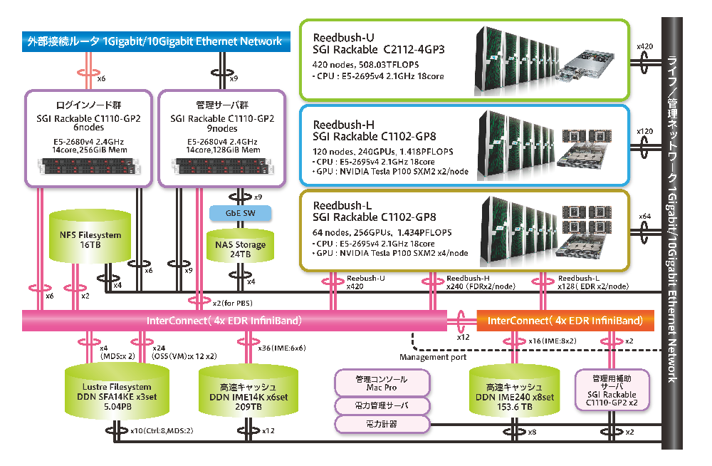
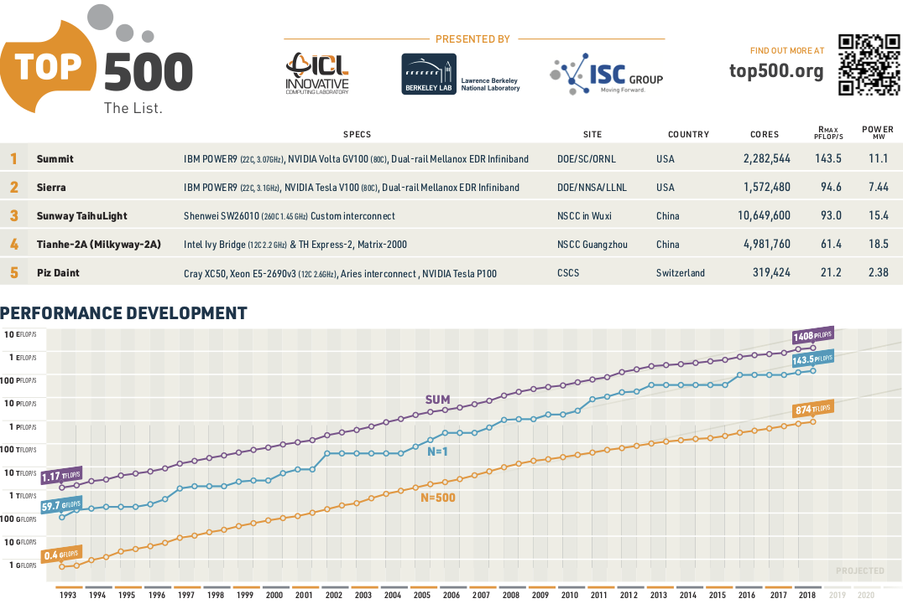
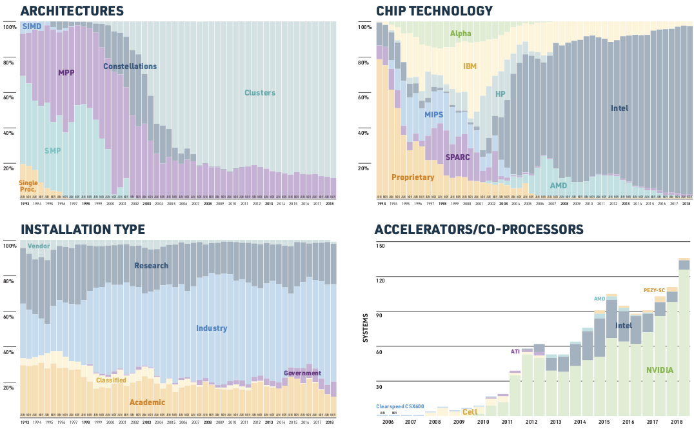
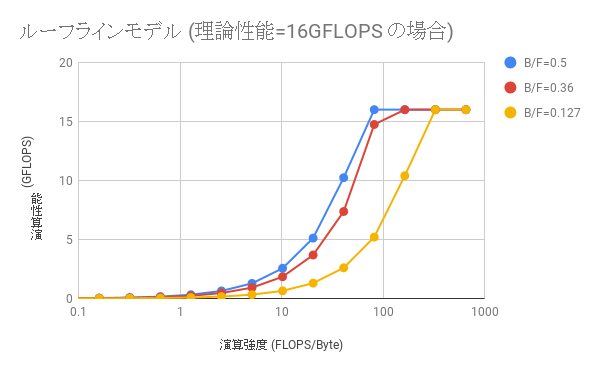
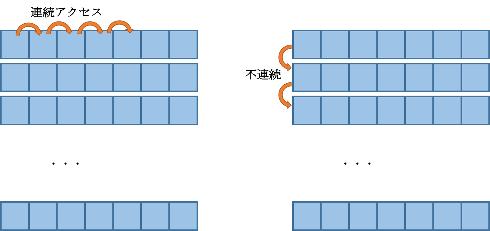
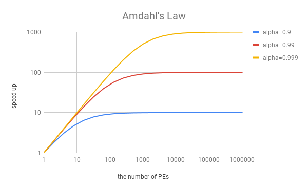
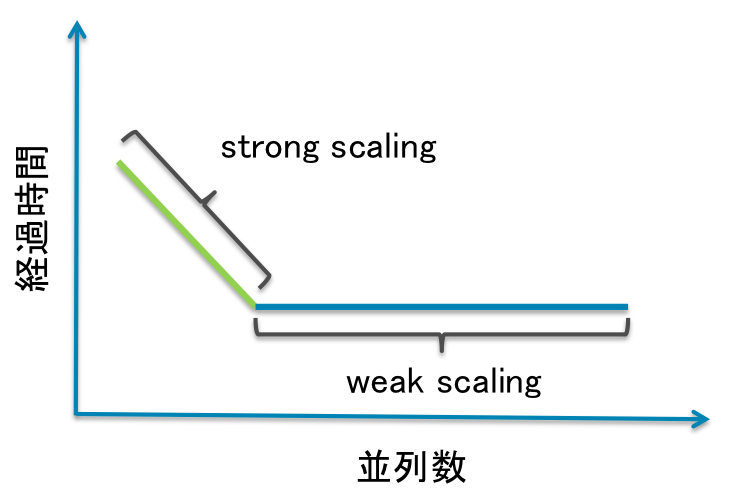
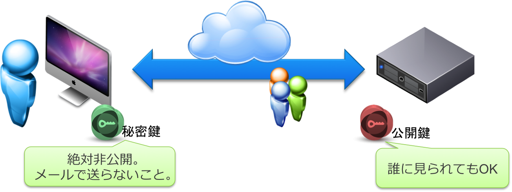

<!-- $size: A4 -->
<!-- $theme: default -->
<!-- $template: invert -->
<!-- page_number: true -->
<!-- *page_number: false -->
<!-- footer: -->

# Seminar for Development of Practical Simulation Softwares (HPC basics)

## 平野 敏行 (Toshiyuki HIRANO)

## `t-hirano [at] iis.u-tokyo.ac.jp`

## 2019/04/16

---
# Introduction


---
# Aims

- learn basics of the HPC-programing
    - basics of HPC hardware
    - basics of prallel programing
- HOMEWORK(basic excercise)


---
# HOMEWORK(basic excercise)


---
# Goals of the basic excercise

- usage of the Linux system and MPI/OpenMP
    - treat files and directories on the Linux system
    - edit and display text files
- C/C++ programing
    - output datas to terminal
    - read and write binary files
    - allocate and release dynamic memories
    - compile and run
    - write Makefile
- parallel processing
    - MPI/OpenMP
    - prepare for application exercises


---
# 宿題-基礎演習(Homework; Basic excercise)

- 以下を満たすプログラムを作成しなさい:
  Create a program that satisfies the following:
    - バイナリファイルで与えられた行列A, Bの積Cを計算する。
      The program calculates the product, C, of the matrices A and B given as the binary file.
    - 行列Cを指定されたフォーマットでファイルに出力する。
      The program output the matrix, C, to a binary file in the specified format.
      

- 最新情報・ヒントはwikiを参照すること
  See the wiki for the last information and hints.
    - https://gitlab.com/ut-sdpss/2019-lecture/wikis/基礎演習課題
    - https://gitlab.com/ut-sdpss/2019-lecture/wikis/BasicExercise


---
# 注意事項(Notes)

- 行列の次元はファイルに記録されているのでハードコーディングしないこと
  Since the dimension of the matrix is recorded in the file, should not be hard-coded.
- 倍精度で計算・出力すること
  Use double precision.
- MPIおよびOpenMPで並列計算すること
  Use parallel computing by using MPI and OpenMP
    - BLASなどの行列演算ライブラリを使用しないこと
      NOT use linear algebra packages such as the BLAS.
        - テストに使用することは可
        - サンプルは用意してあります
- dead line:　2018/May/中旬 (wikiを参照; see the wiki pages)
    - スケーラビリティのテスト(excelファイル)も添付のこと

---
# Spec of matrix file

- 先頭から32bit符号付き整数(int)で行数、列数が順に格納される
The number of rows and columns are sequentially stored with a 32-bit signed integer (int) from the top
- その後、行列の値が倍精度浮動小数点型(double)で値が格納される
After that, the matrix elements are stored in double precision floating point type
    - 行優先(row-oriented)
    - eg.) (0, 0), (1, 0), (2, 0), … (N-1, 0), (1, 0), …, (N-1, N-1)


---
# Outline of the High Performance Computing (HPC)


---
# super computer

- 最新技術が搭載された最高性能のコンピュータ
  The highest performance computer equipped with the latest technology
    - 高性能計算: High Performance Computing
    - 基本構成(CPU, memory, disk, OS etc.)はPCと同じ
    - 高価: expensive
    - 最近の流行は分散並列型(distributed memory machine)
    
---
# Reedbush-U system @UT

- https://www.cc.u-tokyo.ac.jp/supercomputer/reedbush/system.php




---
# Top500 (http://top500.org/) (1/2)

    R_peak: 理論性能値(theorotical maximum performance; calculated)
    R_max: 実効性能値(determine by HPL benchmark)




---
# Top500 (2/2)




---
# LinuxがスパコンTOP500でOSシェア100％に

- https://www.zdnet.com/article/linux-totally-dominates-supercomputers/
- https://japan.zdnet.com/article/35110755/


---
# HPC programing

ハードウェアの性能を十分発揮させるために


---
# HPC performance

## FLOPS
- Floating Point Operations Per Second
- 1秒間に浮動小数点演算(Floating Point Operations)が何回実行できるか
    - (theoritical) FLOPS = クロック周波数(clocks) x コア数(cores) x クロックあたりの浮動小数点演算数(FLOPS/clocks=op)
    - クロック周波数: 1秒あたりの処理回数
    - 例えば iMac (Intel Core i5 2.8 GHz Quad-core)
        - 2.8 GHz x 4 core x 16 op = 179.2 GFLOPS

---
# 浮動小数点数(Floating Point)

- Numeric expression in computer
  - IEEE 754
- 種類

|       | 情報量 (bit)       |備考                        |
|:------|:------------------|:---------------------------|
| 単精度 |   32 (=  4 octet) |Single Precision; SP; float |
| 倍精度 |   64 (=  8 octet) |Double Precision; DP; double|
| 4倍精度|  128 (= 16 octet) |Quad Presicion              |
| 半精度 |   16 (=  2 octet) |half                        |


---
# 様々なCPUのクロックあたりの浮動小数点演算数

    SSE: ストリーミングSIMD拡張命令(Streaming SIMD Extensions)
      SIMD: single instruction multiple data
    FMA: 積和演算(fused multiply-add)


|CPU                    |                  |備考                    |
|:----------------------|-----------------:|-----------------------|
|Intel Core2, ~Nehalem  | 4 DP FLOPS/Clock |SSE2(add)+SSE2(mul) |
|Intel Sandy Bridge~    | 8 DP FLOPS/Clock |4-wide FMA            |
|Intel Haswell~         |16 DP FLOPS/Clock |4-wide FMA x 2        |
|AMD Ryzen              | 8 DP FLOPs/Cycle |4-wide FMA            |
|Intel Xeon Phi (K.L.)  |32 DP FLOPs/Clock |8-wide FMA x 2        |


---
# CPUの浮動小数点演算能力

|名称                      |                       |備考             |
|:------------------------|----------------------:|-----------------|
|Pentium (300 MHz)        |   300 MFLOPS          |1993; 1 F/C × 300MHz |
|Pentium II (450 MHz)     |   450 MFLOPS          |1997            |
|Pentium III (1.4 GHz)    |  2.1 GFLOPS           |1999; 1.5 F/C × 1.4 GHz|
|Pentium 4 (3.8 GHz)      |   7.6 GFLOPS          |2000; 2 F/C × 3.8 GHz|
|Core2Duo                 |  27 GFLOPS            |2006; 1.5 F/C ×2.33 GHz ×2|
|Core i7(Sandy Bridge)    | 158 GFLOPS            |2011; 8 F/C ×3.3 GHz ×6|
|Core i7(Haswell)         | 384 GFLOPS            |2013; 16 F/C × 3.0 GHz × 8|
|Core i7(Broadwell)       | 480 GFLOPS            |2014; 16 F/C × 3.0 GHz × 10|

---
# GPUの浮動小数点演算能力

|名称                      |                       |備考             |
|:------------------------|----------------------:|-----------------|
|NVIDIA GeForce GTX 1080  |SP(FP32):  8.87 TFLOPS |              |
|                         |DP(FP64):  138 GFLOPS  |                 |
|NVIDIA Tesla P100        |SP(FP32):  9.3 TFLOPS  |              |
|                         |DP(FP64):  4.7 TFLOPS  |                 |
|Radeon R9 290X           |SP(FP32)：5.63 TFLOPS  |              |
|                         |DP(FP64)：1.4 TFLOPS   |                 |
|Radeon VII               |SP(FP32): 13.4 TFLOPS  ||
|                         |DP(FP64): 3.4 TFLOPS   ||


---
# 様々なハードの浮動小数点演算能力

|名称                      |                       |備考             |
|:------------------------|----------------------:|-----------------|
|Apple A8                 |      115 GFLOPS       |iPhone6          |
|PS4                      |     1.84 TFLOPS       |                 |
|地球シミュレータ            |    35.86 TFLOPS       |初代             |
|京                       |    10.51 PFLOPS       |                 |
|神威太湖之光               |    93.01 PFLOPS       |                 |
|Summit                   |    143.5 PFLOPS       |                 |


---
# Memory Bandwidth

- 単位時間あたりに転送できるデータ量
    - 理論バンド幅 = DRAMクロック周波数(clock) x 1クロックあたりのデータ転送回数(cycle) x メモリバンド幅 (bandwidth: 8 byte) x CPUメモリチャンネル数 (channels)
        - DDR3-1600:
        (DRAMクロック周波数 x 1クロックあたりのデータ転送回数) = 1600
    - iMac (Intel Core i5-5575R, DDR3)
        - 1867 MHz x 8 x 2 = 29872 MB/s = 29.9 GB/s
	- Reedbush 1node (DDR4-2400) 153.6 GB/s
    - 計算ノード間(Reedbush-U; InfiniBand EDR 4x): 100 Gbps = (100/8) GB/s = 12.5 GB/s
- 単純な計算を大量に行う場合は、メモリバンド幅が性能を決める
When performing simple calculations in large quantities, the memory bandwidth determines the performance.


---
# Byte per FLOPS

- 通称 B/F値
- 1回の浮動小数点演算の間にアクセスできるデータ量
    - Reedbush: 153.6 GB/s / (2.1x16x36) GFLOPS = 0.127
    - FX10: 85 GB/s / 236.5 GFLOPS = 0.36
    - SR16000: 512 GB/s / 980.48 GFLOPS = 0.52
- 参考
    - 倍精度実数(double)は8 octet(byte):   
    3度の読み書き(e.g. c=a*b)で 8 x 3 = 24 octet(byte)
        - B/F値 24以上必要
        - FX10: 0.36 / 24 = 0.015 (98.5% CPUは遊んでる)
        - Reedbush: 0.127 / 24 = 0.0053 (99.5% CPUは遊んでる!)
- CPUさえ速ければ、コア数さえ多ければ、単純に速いわけではない！


---
# ルーフラインモデル

- メモリバンド幅(データ転送量)によって演算性能に上限
- 演算性能[FLOPS] = min(理論演算性能[FLOPS], 
        プログラム演算強度[FLOPS/Byte] × メモリバンド幅[Byte/sec])




---
# 階層メモリ構造(Hierarchical memory structure)

|名称                 |記憶容量|アクセス速度(遅延)|転送速度(帯域)|
|:--------------------|-------:|-----------------:|-------------:|
|レジスタ register (on CPU) |   byte |                ns|         GB/s |
|キャッシュ cache  (on CPU) |kB ~ MB |             10 ns|         GB/s |
|(メイン)メモリ memory      |MG ~ GB |            100 ns|      100 MB/s|
|ハードディスク HDD         |GB ~ TB |             10 ms|      100 MB/s|

- キャッシュを効率的に使わないと遅い
It is slow if you do not use cash efficiently

---
# メモリ上のデータ格納構造: data structure in memory

- データはまとまって取り扱われる(=cache line)
    - 連続したデータは近く(キャッシュ内)に存在する確率が高い
        - cache hit
    - 不連続データアクセスはcache missを引き起こしやすい
- (C/C++言語)One dimensional array is continuous data
    - うまく活用することで高速化が期待できる


---
# memory access in matrix-matrix multiplication




---
# Performance Tuning (Single Process) 

- CPUへ如何にうまくデータを送り込ませるかがポイント
- 転送量(transfer) < 演算量(computing) の場合
    - データを使いまわして高速化 → ブロック化
    - eg.) matrix-matrix multiplication
        - data: $N^2$
        - computation $N^3$
- 転送量(transfer) > 演算量(computing) の場合
    - 高速化は難しい
        - 余計に計算する(メモリ転送量を減らす)ことも一考
    - eg.) matrix-vector multiplication
    - eg.) House holder triple diagonalization
        - 行列-ベクトル積が必要 → 帯行列にする


---
# parallel computing


---
# なぜ並列化が必要なのか

- “The Free Lunch Is Over”
    - http://www.gotw.ca/publications/concurrency-ddj.htm


---
# The Free Lunch Is Over

1. クロックが上がるとソフトウェアのパフォーマンスも勝手に向上
Improve software performance arbitrarily as clock rises
1. クロック上昇の限界
Limit of clock rise
1. CPUを複数使用するしかない
Only have to use multiple CPUs
1. 並列処理のプログラムを書かねばパフォーマンスが上がらず
Performance does not rise unless you write a parallel processing program!

---
# 並列化プログラミングの心構え

- 本当に並列化が必要か Is it really necessary to parallelize?
    - まずは単体動作でのチューニングをすべき
      First we should tune on standalone operation
- どこを並列化すべきか Where should we parallelize?
    - Pareto principle (80:20の法則)
    - プロファイラ等を使い、どの関数・ループが処理に時間がかかるかを見つける
      Using a profiler, find out which function or loop takes time to process
    - 思い込みは禁物 Never imagined
- 並列化したらなんでも速くなると思ったら大間違い
  Will your program become faster if you parallelize? No, it's a big mistake!

---
# (並列)性能評価指標 (1/4)

## 台数効果 Number Effect (高速化率 Acceleration rate)

$$
S_P = \frac{T_S}{T_P}
$$

- $T_S$ : 1台(serial)での実行時間
- $T_P$ : 複数台($P$台; parallel)での実行時間
- どれだけ早く計算できるようになったかを示す指標
    - $S_P = P$ が理想的(多くは $S_P < P$)
    - $S_P>P$ はsuper linear speedup とよばれる
    - キャッシュヒットなどによって高速化されたケースなど


---
# (並列)性能評価指標 (2/4)

## 並列化効率 Parallelization efficiency

$$
E_P = \frac{S_P}{P} \times 100  
$$

- 並列化がどれだけ上手に行われているかを示す指標


---
# (並列)性能評価指標 (3/4)

## アムダールの法則 Amdahl's law

- 1台での実行時間$T_S$のうち、並列化ができる割合(並列化率)を$a$とすると、
$P$台での並列実行時間$T_P$は
$$
T_P = \frac{T_S}{P} \cdot a + T_S (1-a)
$$

- したがって台数効果は
$$
S_P = \frac{T_S}{T_P} = \frac{1}{(a / P +(1- a))}
$$

- 無限台使っても(P→∞), 台数効果は$1/(1-a)$しか出ない


---
# (並列)性能評価指標 (4/4)

## アムダールの法則のポイント

- 全体の90%を並列化しても、1/(1-0.9)=10倍で飽和する



- 「京」(約100万並列)で性能を出す(並列化効率90%以上)には並列化率はいくら必要か？


---
# Processing that becomes faster by parallelization / that does not get faster

- "並列化出来る処理"と"頑張っても並列化できない処理"とがある


---
# スケーラビリティ(並列性能向上)の評価

## Strong Scaling
  - 問題規模は一定
  - プロセス数を増加
  - 並列数が多くなると達成は困難 (cf. アムダールの法則)
## Weak Scaling
  - 1プロセスあたりの問題規模を一定
  - プロセス数を増加




---
# 基礎演習でのExcelシートの使い方
  How to use the excel sheets in the basic excercise


---
# Process and Threads

- Process
    - OSから独立したリソースを割り当てられる
      The independent computer resource is assigned by the OS 
        - CPU
        - メモリ空間; Memory space
    - 1つ以上のスレッドを持つ
      Process has one and more threads 
- Thread
    - 実行単位; execution unit
    - 各スレッドはプロセス内メモリを共有する
      Each thread shares the process memory
- see
    - Activity Monitor (@MacOS)
    - top (@UNIX)

---
# 並列プログラミングの方法1- Method of parallel programming

## Multi-process
  - プロセス間でデータのやりとりをする仕組み
    Data is exchanged between processes
  - プロセス間でメモリ空間は(基本的には)共有できない
    Memory space can not be shared between processes
  - 別の計算機上にあるプロセスとも通信できる
    It can also communicate with processes on another computer
  - eg.) MPI(Message Passing Interface)

---

# 並列プログラミングの方法2 - Method of parallel programming

## Multi-threads
  - プロセス内部で複数スレッドが並列動作
    Multiple threads operate in parallel within the process
  - プロセスのメモリ空間を複数スレッドで共有できる
    Memory space can be shared between threads in the process
  - 排他処理が必要
    Exclusive processing required 
  - 同一システム上でしか動作しない
    It works only on the same system
  - eg.) pthread(POSIX thread), OpenMP


---
# MPIの特徴 Features of MPI

- ライブラリ規格の一つ One of the library standards
    - プログラミング言語、コンパイラに依存しない
      It is independent of programming language and compiler
    - API(Application Programing Interface)を標準化
    - 実装がまちまち
- 大規模計算が可能 Large scale calculation is possible
    - 高速ネットワークを介したプロセス間通信が可能 
      Enable interprocess communication via high-speed network
- プログラミングの自由度が高い Free parallel comunication programing
    - 通信処理を自由にプログラミングすることで最適化が可能
      Optimize by freely programming communication processing
    - 裏を返せばプログラミングが大変


---
# MPIの実装 Implementation

- MPICH
    - Argonne National Laboratoryで開発
    - MPICH1, MPICH2など
- OpenMPI
    - Open-source
    - 最近のLinuxディストリビューションで採用されつつある
- MPI presented by the vender
    - optimized MPI by the vender 
    - MPICH2がベースが多い


---
# MPIプログラミングの作法 Rules

+ Initialize
  - 使う資源(リソース)を確保・準備する
  - All processes need to call
  - MPI_Init()関数
+ Finalize
  - 使った資源(リソース)を返す
  - 返さないとゾンビ(ずっと居残るプロセス)になる場合も
  - All processes need to call
  - MPI_Finalize()関数


---
# MPI関数の性質 Characters

## 通信 Communication
- 集団通信 Collective communication
  - 全プロセスが通信に参加
  - 全プロセスが呼ばなければ止まる
- 1対1通信
  - 通信に関与するプロセスのみが関数を呼ぶ
## Blocking / non-Blocking
- Blocking
  - 通信が完了するまで次の処理を待つ
    Wait for next processing until communication is completed
- non-Blocking
  - 通信しながら別の処理が可能
    Different processing is possible while communicating


---
# 主なMPI関数 (初期化)

## MPI_Init

```
#include <mpi.h>
int MPI_Init(int *argc, char **argv);
```

- MPI環境を起動・初期化する
- パラメータ
    - argc: コマンドライン引数の総数
    - argv: 引数の文字列を指すポインタ配列
- 戻り値: MPI_Success(正常)


---
# 主なMPI関数 (後始末)

## MPI_Finalize

```
#include <mpi.h>
int MPI_Finalize();
```

- MPI環境の終了処理を行う


---
# 主なMPI関数 (ユーティリティ: 1/2)

## MPI_Comm_size

```
#include <mpi.h>
int MPI_Comm_size(MPI_Comm comm, int *size);
```

- コミュニケータに含まれる全プロセスの数を返す
- コミュニケータには全MPIプロセスを表す定義済みコミュニケータ`MPI_COMM_WORLD`が使用できる
- パラメータ
    - comm: (in) コミュニケータ
    - size: (out) プロセスの総数
- 戻り値: MPI_Success(正常)


---
# 主なMPI関数 (ユーティリティ: 2/2)

## MPI_Comm_rank

```
#include <mpi.h>
int MPI_Comm_rank(MPI_Comm comm, int *rank);
```

- コミュニケータ内の自身のプロセスランクを返す
    - ランクは0から始まる
- パラメータ
    - comm: (in) コミュニケータ
    - rank: (out) ランク
- 戻り値: MPI_Success(正常)


---
# 主なMPI関数 (全体通信: 1/2)

## MPI_Bcast

```
#include <mpi.h>
int MPI_Bcast(void* buf, int count, MPI_Datatype datatype,   
int root, MPI_Comm comm);
```

- rootからcommの全プロセスに対してbroadcastする
- パラメータ
    - buf: (in)  送信バッファのアドレス
    - count: (in) 送信する数
    - datatype: (in) データ型
    - root: (in) 送信元ランク
    - comm: (in) コミュニケータ
- 戻り値: MPI_Success(正常)


---
# 主なMPI関数 (全体通信: 2/2)

## MPI_Allreduce

```
#include <mpi.h>

int MPI_Allreduce(void* sendbuf, void* recvbuf, int count,   
MPI_Datatype datatype, MPI_Op op, MPI_Comm comm);
```

- 集計した後、結果を全プロセスへ送信する
- パラメータ
    - sendbuf: (in) 送信バッファのアドレス
    - recvbuf: (in) 受信バッファのアドレス
    - count: (in) 送信する数
    - datatype: (in) データ型
    - MPI_Op: (in) 演算オペレータ
    - comm: (in) コミュニケータ
- 戻り値: MPI_Success(正常)


---
# 主なMPI関数 (単体通信: 1/4)

## MPI_Send

```
#include <mpi.h>

int MPI_Send(void* buf, int count, MPI_Datatype datatype,   
int dest, int tag, MPI_Comm comm);
```

- destプロセスへデータを送る
- パラメータ
    - buf: (in) 送信バッファのアドレス
    - count: (in) 送信する数
    - datatype: (in) データ型
    - dest: (in) 送信先ランク
    - tag: (in) タグ
    - comm: (in) コミュニケータ
- 戻り値: MPI_Success(正常)


---
# 主なMPI関数 (単体通信: 2/4)

## MPI_Recv

```
#include <mpi.h>

int MPI_Recv(void* buf, int count, MPI_Datatype datatype,   
int source, int tag, MPI_Comm comm, MPI_Status* status);
```

- sourceプロセスからのデータを受け取る
- パラメータ
    - buf: (in) 送信バッファのアドレス
    - count: (in) 送信する数
    - datatype: (in) データ型
    - source: (in) 送信元ランク
    - tag: (in) タグ, comm: (in) コミュニケータ
    - status: (out) ステータス情報
- 戻り値: MPI_Success(正常)


---
# 主なMPI関数 (単体通信: 3/4)

## MPI_Isend

```
#include <mpi.h>

int MPI_Isend(void* buf, int count, MPI_Datatype datatype,   
int dest, int tag, MPI_Comm comm, MPI_Request* request);
```

- destプロセスへデータを送る
- パラメータ
    - buf: (in) 送信バッファのアドレス
    - count: (in) 送信する数
    - datatype: (in) データ型
    - dest: (in) 送信先ランク
    - tag: (in) タグ, comm: (in) コミュニケータ
    - request: (out) リクエストハンドル
- 戻り値: MPI_Success(正常)


---
# 主なMPI関数 (単体通信: 4/4)

### MPI_Irecv

```
#include <mpi.h>

int MPI_Recv(void* buf, int count, MPI_Datatype datatype,   
int source, int tag, MPI_Comm comm, MPI_Request* request);
```

- sourceプロセスからのデータを受け取る
- パラメータ
    - buf: (in) 送信バッファのアドレス
    - count: (in) 送信する数
    - datatype: (in) データ型
    - source: (in) 送信元ランク
    - tag: (in) タグ
    - comm: (in) コミュニケータ
    - request: (out) リクエストハンドル


---
# 主なMPI関数 (通信その他)

## MPI_Barrier

```
#include <mpi.h>

int MPI_Barrier(MPI_Comm comm);
```

- 同期をとる
- パラメータ
    - comm: (in) コミュニケータ


---
# 主なMPI関数 (通信その他)

## MPI_Wait

```
#include <mpi.h>

int MPI_Wait(MPI_Request* request, MPI_Status* status);
```

- 変数の通信待ち処理を行う
- パラメータ
    - request: (in) リクエストハンドル
    - status: (out) 受信状態


---
# 主なMPI関数 (通信その他)

## MPI_Wtime

```
#include <mpi.h>

double MPI_Wtime();
```

- ある時刻からの秒数を返す
- とある処理の両端で計測し、その差分を計算すると経過時間がわかる
- OpenMPI 1.10.5, 1.10.6, 2.0.2 は不具合注意

---
# MPIデータ型

|C/C++ data type|MPI data type    |
|:--------------|:----------------|
|char           |MPI_CHAR         |
|int            |MPI_INT          |
|long           |MPI_LONG         |
|float          |MPI_FLOAT        |
|double         |MPI_DOUBLE       |
|unsigned char  |MPI_UNSIGNED_CHAR|
|unsigned int   |MPI_UNSIGNED_INT |
|unsigned long  |MPI_UNSIGNED_LONG|


---
# MPI サンプルコード(1/2)

```
#include <iostream>
#include <unistd.h>
#include <mpi.h>

int main(int argc, char *argv[])
{
    MPI_Init(&argc, &argv);

    int rank = 0;
    int size = 0;
    MPI_Comm_rank(MPI_COMM_WORLD, &rank);
    MPI_Comm_size(MPI_COMM_WORLD, &size);
```


---
# MPI サンプルコード(2/2)

```
    char hostname[256];
    for (int i = 0; i < size; ++i) {
        if (i == rank) {
            gethostname(hostname, sizeof(hostname));
            std::cout << "rank=" << i << ", hostname=" << hostname << std::endl;
        }
        MPI_Barrier(MPI_COMM_WORLD);
    }

    MPI_Finalize();
    return 0;
}
```

---
# MPIプログラミングのコツ

- コンパイラは専用のもの(mpicxx, mpifortなど)を使う
    - コンパイル・ビルドに必要なライブラリやインクルードパスを自動的に設定してくれる
- 実行は実装によって異なる
    - mpirun? mpiexec?
    - 実装毎に環境変数も変わる
- 基本的にデバッグは難しい
    - 逐次(シリアル)版でバグは潰しておく
    - デバッガに頼らず、何かに出力するようにした方が無難
    - gdbオプションも時には使える
- プロファイル
    - gprofならGMON_OUT_PREFIX環境変数を使うと良い


---
# comments for MPI

- MPIもソフトウェア
    - バグは少なからずある
    - なるべく実績のある(よく使われる)APIを使う
- MPI-1を使った方が良い(場合がある)
    - MPI-2 以上は多機能な反面、システムによって挙動が異なる場合がある
    - MPI-1で(やりたいことは)基本的に実現可能
        - 可変長配列を送るときは、はじめに配列数を転送するなど工夫する。
- 非同期通信が必ずしも良いとは限らない
    - デバッグ作業は格段に難しくなる
    - MPI_Test(), MPI_Wait()が呼ばれて初めて通信を開始する実装がある

---
# MPI Appendix

## 派生データ型
- 構造体を通信したいときに、オリジナルのデータ型を作成できる
  - MPI_Type_create_struct (MPI_Type_struct)
  - MPI_Type_Commit

## MPI I/O
- 巨大なファイルを各プロセスが同時に読み書きする仕組み
  - MPI_File_open, MPI_File_close
  - MPI_File_set_view
  - MPI_File_write_all


---
# OpenMP


---
# OpenMPの特徴

- C/C++およびFortranプログラミング言語をサポートするAPI(Application Program Interface)
    - 指示文(pragmaなので非対応コンパイラでも問題なし)
    - 専用のライブラリをリンク
    - 環境変数で動作を制御
- 共有メモリ型並列計算機上で動作する
- 並列処理する箇所を明示する必要がある
    - 自動並列化ではない
- データ分割を指示しなくても良い
    - プログラミングが楽
    - 裏を返せば、処理がブラックボックス化
- 最近はGPUコードも吐けるように


---
# OpenMPの書き方(C/C++)

- 並列実行
```
#pragma omp parallel
{
…
}
```

- 並列実行(forループ)
```
#pragma omp parallel for
for (int i = 0; i < 10; ++i) {
…
#pragma omp critical (name) ← クリティカルリージョン
    {
      …
    }
}
```


---
# OpenMP サンプル(1/2)

```
#include <iostream>
#include <omp.h>

int main()
{
    std::cout << "# of procs: " << omp_get_num_procs() << std::endl;
    std::cout << "max threads: " << omp_get_max_threads() << std::endl;

#pragma omp parallel
    {
        int id = omp_get_thread_num();
        std::cout << "thread #: " << id << std::endl;
    }
```


---
# OpenMP サンプル(2/2)

```
    int sum = 0;
#pragma omp parallel for
    for (int i = 0; i < 10000; ++i) {

#pragma omp atomic
        sum += i;
    }

    std::cout << "sum=" << sum << std::endl;

    return 0;
}

```


---
# 代表的なOpenMP pragma (1)

## ブロックを並列化

```
#pragma omp parallel
{
...
}
```


---
# 代表的なOpenMP pragma (2)

## forループを並列化 (forを分割処理)
```
#pragma omp parallel
{
#pragma omp for
    for (int i = 0; i < 100; ++i) {
    ...
    }
}
```

## forループを並列化 (parallelと一緒に指定)
```
#pragma omp parallel for
for (int i = 0; i < 100; ++i) {
...
}
```


---
# 代表的なOpenMP pragma (3)

## sectionを並行に実行

```
#pragma omp parallel sections
{
#pragma omp section
    {
    ...
    }

#pragma omp section
    {
    ...
    }
}
```


---
# 代表的なOpenMP pragma (4)

## 1つのスレッドだけが実行

```
#pragma omp parallel
{
#pragma omp single
    {
    ...
    }
}
```


## 直後のブロックを排他的に処理

```
#pragma omp parallel
{
#pragma omp critical
    {
    ...
    }
}
```


---
# 代表的なOpenMP pragma (5)

## スレッドの同期を取る

```
#pragma omp parallel
{
#pragma omp barrier

}
```

## 共有変数のメモリの一貫性を保つ

```
#pragma omp parallel
{
#pragma omp flush
}
```


---
## OpenMP ライブラリ関数
    
- don't forget include <omp.h>

```
#include <omp.h>
```

|functions              |  processing                     |
|:----------------------|:--------------------------------|
| omp_get_num_procs()   | プロセッサの数を返す                |
| omp_get_max_threads() | 実行可能なスレッドの最大数を取得      |
| omp_get_num_threads() | 実行しているスレッド数を取得          |
| omp_get_thread_num()  | 実行しているスレッド番号を取得        |
| omp_get_wtime()       | ある時刻からの秒数を取得            |


---
# OpenMP 注意点

ビルド時は多くの場合コンパイルオプションが必要
- gnu compiler

```bash
$ gcc -fopenmp
```

- intel compiler
```bash
$ icpc –openmp
```

- 共有変数かprivate変数かを意識すること
    - `#omp parallel` 文の前にある変数は共有変数
- 環境変数に注意
    - `OMP_NUM_THREADS`: 並列スレッド数を設定する
    - `OMP_SCHEDULE`: 並列動作を指定
- コンパイラによって実装・挙動が異なる場合がある


---
# MPI/OpenMP ハイブリッド並列

## Flat MPI
- ノード間はMPIノード内もMPI
- ノード内のメモリが共有できない(プロセスあたりのメモリ量が少ない)
- MPIのコードだけを書けばよい

## Hybrid
- ノード間はMPI / ノード内はOpenMP
- ノード内メモリをプロセスが占有できる
- 2種類の並列コードを書かないといけない


---
# 参考文献

## MPI

- 青山幸也 著, MPI虎の巻, http://www.hpci-office.jp/invite2/documents2/mpi-all_20160801.pdf
- P.パチェコ 著, MPI並列プログラミング ISBN-13: 978-4563015442
- 片桐孝洋 著, スパコンプログラミング入門: 並列処理とMPIの学習 ISBN-13: 978-4130624534

## OpenMP

- OpenMP入門 http://www.isus.jp/article/openmp-special/getting-started-with-openmp/
- 北山 洋幸 著, OpenMP入門―マルチコアCPU時代の並列プログラミング ISBN-13: 978-4798023434


---
# 演習環境の構築 Setup your working environment


---
# 概要

+ log in the ECCS machine (iMac)
+ open a terminal
+ login to the super-computer system by using ssh

- 2つのアカウント (ECCSとスパコン) の違いに注意!

---
# ssh接続の仕組み

- 暗号化の必要性
    - インターネットにおけるデータの盗聴・なりすましの危険
- 公開鍵方式
    - 秘密鍵で暗号化したデータ → 公開鍵でしか復号できない
    - 公開鍵で暗号化したデータ → 秘密鍵でしか復号できない




---
# making ssh-key

+ open a terminal
+ run ssh-keygen
```bash
$ ssh-keygen -t rsa
```

- created files
  - `$HOME/.ssh/id_rsa`
    - the secret key
    - 誰にも見せないこと DONOT show to anyone
    - メール等で送らないこと DONOT e-maile 
  - `$HOME/.ssh/id_rsa.pub`
    - public key (見られてもOK)


---
# register the public ssh key

- see https://www.cc.u-tokyo.ac.jp/supercomputer/files/QuickStartGuide.pdf
- procedure
    + open your web browser (eg. safari)
    + open the following URL
        - https://reedbush-www.cc.u-tokyo.ac.jp/
    + submit your account and password
        - パスワードはそのものではなく、表示されている文字列の**奇数**番目を繋ぎ合わせたもの
        - The password is not itself, but stitched odd numbers of characters
     + submit your public ssh key


---
# login to the super computer

- type in your terminal 

```bash
$ ssh <supercomputer account>@reedbush-u.cc.u-tokyo.ac.jp
```

- パスフレーズが聞かれた場合は、設定したパスフレーズを入れる
  When a passphrase is asked, put the passphrase that you set


---
# transmit files (scp)

```bash
$ scp <from> <to>
```

- cp コマンドと同様の使い方 (第４文型: SVOO)
    - -r オプションで(サブ)ディレクトリも一緒に
- How to specify the location (filepath)
    - [[account@]server:]directory.../filename
    - サーバー名を省略した場合はローカルマシンが想定
      If the server name is omitted, the local machine is assumed

- from local machie to remote
```
$ scp ./sample.c  xxxx@reedbush-u.cc.u-tokyo.ac.jp:somewhere
```

- from remote machine to local
```
$ scp xxxx@reedbush-u.cc.u-tokyo.ac.jp:sample.c ./somewhere
```


---
# How to use batch system

多くのスパコンではインタラクティブな実行はせず、バッチ処理を行う
In many supercomputers, do NOT execute interactive, but do batch processing

- usage

|内容                        | コマンド              |
|---------------------------|----------------------|
|ジョブの投入 submit job      | qsub \<script>        |
|状況確認 check your jobs     | rbstat               |
|ジョブの削除 delete your jobs | qdel \<job ID>       |

