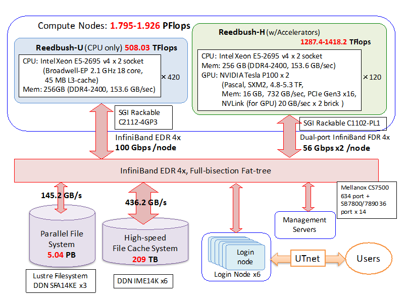
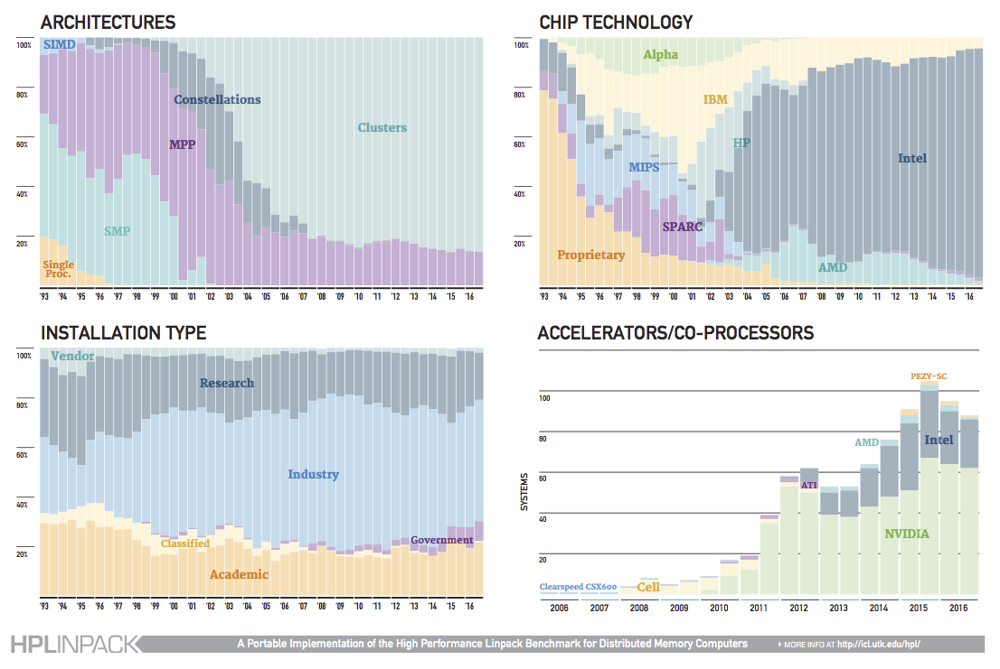
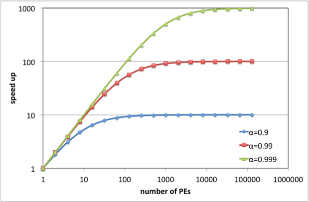

<!-- $size: A4 -->
<!-- $theme: default -->
<!-- $template: invert -->
<!-- page_number: true -->
<!-- *page_number: false -->
<!-- footer: -->

# 実践的シミュレーションソフトウェアの開発演習(HPC基礎)

## 平野 敏行
## 2017/04/13

---
# はじめに


---
# 目的

- HPCプログラミングに必要な基礎を身につける
    - HPCハードウェアの基礎知識
    - 並列プログラミングの基礎知識
- 提出課題: 基礎演習


---
# 基礎演習 (提出課題)


---
# 目的

- Linuxシステム・MPI/OpenMPの使い方に慣れる
    - ファイル・ディレクトリの操作
    - テキストファイルの作り方・表示
- C/C++によるプログラミングを習得
    - ターミナルへの出力方法(printf() etc.)の習得
    - バイナリファイルの読み書き(fopen(), get() etc.)を習得
    - 動的なメモリ確保・開放の方法を取得
    - コンパイル・実行の仕方
    - Makefileの書き方
- 並列処理
    - 簡単なMPI / OpenMPの並列計算の書き方・挙動を習得
    - 応用演習に備える


---
# 課題内容

- 以下を満たすプログラムを作成しなさい。
    - バイナリファイルで与えられた行列A, Bの積Cを計算する。
    - 行列Cを指定されたフォーマットでファイルに出力する。

- 最新情報・ヒントはwikiを参照すること
    - https://bitbucket.org/hiracchi/2017lecture/wiki/基礎演習課題(行列積)について

- わからないことは何でも聞いてください。


---
# 注意事項

- 行列の次元はファイルに記録されている
    - (コードに決め打ちしないこと)
- 倍精度で計算・出力すること
- 並列計算すること
    - 短い時間で処理できること
    - 高い並列化効率を達成すること
    - BLASなどの行列演算ライブラリを使用しないこと
        - テストに使用することは可
        - サンプルは用意してあります
- 締切:　2017/05/22(木) (暫定)まで
    - スケーラビリティのテスト(excelファイル)も添付のこと

---
# 行列ファイルの仕様

- 先頭から32bit符号付き整数(int)で行数、列数が順に格納される
- 倍精度浮動小数点型(double)で(0, 0), (1, 0), (2, 0), … (N-1, 0), (1, 0), …, (N-1, N-1)の順に値が格納される


---
# HPC概略


---
# スーパーコンピュータ

- 当時の最新技術が搭載された最高性能のコンピュータ
    - High Performance Computing (高性能計算)
    - 基本構成(CPU, メモリ, ディスク, OS等)は  
      パーソナルコンピュータと同じ
    - 非常に高価
    - 最近の流行は分散並列型
    
---
# Reedbush-Uシステム概略

- http://www.cc.u-tokyo.ac.jp/system/reedbush/reedbush_intro.html




---
# Top500 (http://top500.org/) (1/2)

    R_peak: 実効性能値
    R_max: 理論性能値


---
# Top500 (2/2)




---
# HPCプログラミング

ハードウェアの性能を十分発揮させるために


---
# コンピュータの性能評価

## FLOPS
- Floating Point Operations Per Second
- 1秒間に浮動小数点演算(Floating Point Operations)が何回実行できるか
    - 理論FLOPS = クロック周波数 x コア数 x クロックあたりの浮動小数点演算数
    - クロック周波数: 1秒あたりの処理回数
    - 例えば iMac (Intel Core i5 2.8 GHz Quad-core)
        - 2.8 GHz x 4 core x 16 op = 179.2 GFLOPS

---
# 浮動小数点数

- コンピュータの数値表現
  - 主に IEEE 754 方式
- 種類

|       | 情報量 (bit)       |備考                        |
|:------|:------------------|:---------------------------|
| 単精度 |   32 (=  4 octet) |Single Precision; SP; float |
| 倍精度 |   64 (=  8 octet) |Double Precision; DP; double|
| 4倍精度|  128 (= 16 octet) |Quad Presicion              |
| 半精度 |   16 (=  2 octet) |half                        |


---
# 様々なCPUのクロックあたりの浮動小数点演算数

```
SSE: ストリーミングSIMD拡張命令(Streaming SIMD Extensions)
  SIMD: single instruction multiple data
FMA: 積和演算(fused multiply-add)
```


|CPU                    |                  |備考                    |
|:----------------------|-----------------:|-----------------------|
|Intel Core2, ~Nehalem  | 4 DP FLOPS/Clock |SSE2(add)+SSE2(mul) |
|Intel Sandy Bridge~    | 8 DP FLOPS/Clock |4-wide FMA            |
|Intel Haswell~         |16 DP FLOPS/Clock |4-wide FMA x 2        |
|AMD Ryzen              | 8 DP FLOPs/Cycle |4-wide FMA            |
|Intel Xeon Phi (K.L.)  |32 DP FLOPs/Clock |8-wide FMA x 2        |


---
# 様々なハードの浮動小数点演算能力

|名称              |                 |備考             |
|:-----------------|----------------:|-----------------|
|GeForce GTX 1080  | SP: 8.87 TFLOPS |GPU              |
|                  | DP:  138 GFLOPS |                 |
|Radeon R9 290X    | SP：5.63 TFLOPS |GPU              |
|                  | DP：1.40 TFLOPS |                 |
|Pentium (300 MHz) |      300 MFLOPS |CPU              |
|Apple A8          |      115 GFLOPS |iPhone6          |
|PS4               |     1.84 TFLOPS |                 |
|地球シミュレータ  |    35.86 TFLOPS |初代             |
|京                |    10.51 PFLOPS |                 |
|神威太湖之光      |    93.01 PFLOPS |                 |


---
# メモリバンド幅

- 単位時間あたりに転送できるデータ量
    - 理論バンド幅 = DRAMクロック周波数 x 1クロックあたりのデータ転送回数  
    x メモリバンド幅 (8 byte) x CPUメモリチャンネル数
        - DDR3-1600なら  
        (DRAMクロック周波数 x 1クロックあたりのデータ転送回数) = 1600
    - iMac (Intel Core i5-5575R, DDR3)
        - 1867 MHz x 8 x 2 = 29872 MB/s = 29.9 GB/s
	- Reedbush 1node (DDR4-2400) 153.6 GB/s
    - 計算ノード間(Reedbush-U; InfiniBand EDR 4x): 100 Gbps = (100/8) GB/s = 12.5 GB/s
- 単純な計算を大量に行う場合は、メモリバンド幅が性能を決める


---
# Byte per FLOPS

- 通称 B/F値
- 1回の浮動小数点演算の間にアクセスできるデータ量
    - Reedbush: 153.6 GB/s / (2.1x16x36) GFLOPS = 0.127
    - FX10: 85 GB/s / 236.5 GFLOPS = 0.36
    - SR16000: 512 GB/s / 980.48 GFLOPS = 0.52
- 参考
    - 倍精度実数(double)は8 octet(byte):   
    3度の読み書き(e.g. c=a*b)で 8 x 3 = 24 octet(byte)
        - B/F値 24以上必要
        - FX10: 0.36 / 24 = 0.015 = 1.5% (つまり 98.5% CPUは遊んでる)
- CPUさえ速ければ、コア数さえ多ければ、単純に速いわけではない！


---
# 階層メモリ構造

|名称                 |記憶容量|アクセス速度(遅延)|転送速度(帯域)|
|:--------------------|-------:|-----------------:|-------------:|
|レジスタ (on CPU)    |   byte |                ns|         GB/s |
|キャッシュ  (on CPU) |kB ~ MB |             10 ns|         GB/s |
|(メイン)メモリ       |MG ~ GB |            100 ns|      100 MB/s|
|ハードディスク       |GB ~ TB |             10 ms|      100 MB/s|

- キャッシュを効率的に使わないと遅い


---
# データ格納構造

- データはまとまって取り扱われる(=キャッシュライン)
    - 連続したデータは近く(キャッシュ内)に存在する確率が高い
        - キャッシュヒット
    - 不連続データアクセスはキャッシュミスを引き起こしやすい
- (C/C++言語の)1次元配列は連続データ
    - うまく活用することで高速化が期待できる


---
# 行列積でのメモリアクセス


---
# 単体チューニング

- CPUへ如何にうまくデータを送り込ませるかがポイント
- 転送量 < 演算量 の場合
    - データを使いまわして高速化 → ブロック化
    - 例： 行列積
        - データ量 $N^2$
        - 演算量 $N^3$
- 転送量 > 演算量 の場合
    - 高速化は難しい
        - 余計に計算する(メモリ転送量を減らす)ことも一考
    - 例： 行列とベクトルの積
    - 例： ハウスホルダー三重対角化
        - 行列-ベクトル積が必要 → 帯行列にする


---
# 並列化プログラミング


---
# なぜ並列化が必要なのか

- “The Free Lunch Is Over”
    - http://www.gotw.ca/publications/concurrency-ddj.htm


---
# フリーランチは終わった

+ クロックが上がるとソフトウェアのパフォーマンスも勝手に向上
+ クロック上昇の限界
+ CPUを複数使用するしかない
+ 並列処理のプログラムを書かねばパフォーマンスが上がらず


---
# 並列化プログラミングの心構え

- 本当に並列化が必要か
    - まずは単体動作でのチューニングをすべき
    - そもそも単体動作で正しく動くことを確認すること
- どこを並列化すべきか
    - パレートの法則(80:20の法則)
    - プロファイラ等を使い、どの関数・ループが処理に時間がかかるかを見つける
    - 思い込みは禁物
- 並列化したらなんでも速くなると思ったら大間違い


---
# (並列)性能評価指標 (1/4)

## 台数効果(高速化率)

$$
S_P = \frac{T_S}{T_P}
$$

- $T_S$ : 1台(serial)での実行時間
- $T_P$ : 複数台($P$台; parallel)での実行時間
- どれだけ早く計算できるようになったかを示す指標
    - $S_P = P$ が理想的(多くは $S_P < P$)
    - $S_P>P$ はsuper linear speedup とよばれる
    - キャッシュヒットなどによって高速化されたケースなど


---
# (並列)性能評価指標 (2/4)

## 並列化効率

$$
E_P = \frac{S_P}{P} \times 100  
$$

- 並列化がどれだけ上手に行われているかを示す指標


---
# (並列)性能評価指標 (3/4)

## アムダールの法則

- 1台での実行時間$T_S$のうち、並列化ができる割合(並列化率)を$a$とすると、
$P$台での並列実行時間$T_P$は
$$
T_P = \frac{T_S}{P} \cdot a + T_S (1-a)
$$

- したがって台数効果は
$$
S_P = \frac{T_S}{T_P} = \frac{1}{(a / P +(1- a))}
$$

- 無限台使っても(P→∞), 台数効果は$1/(1-a)$しか出ない
    - → アムダールの法則


---
# (並列)性能評価指標 (4/4)

## アムダールの法則のポイント

- 全体の90%を並列化しても、1/(1-0.9)=10倍で飽和する



- 「京」(約100万並列)で性能を出す(並列化効率90%以上)には並列化率はいくら必要か？


---
# 並列化ではやくなる処理・はやくならない処理

- "並列化出来る処理"と"頑張っても並列化できない処理"とがある


---
# スケーラビリティ(並列性能向上)の評価

## ストロング・スケーリング
  - 問題規模は一定
  - プロセス数を増加
  - 並列数が多くなると達成は困難 (cf. アムダールの法則)
## ウィーク・スケーリング
  - 1プロセスあたりの問題規模を一定
  - プロセス数を増加


---
# 基礎演習でのExcelシートの使い方


---
# プロセスとスレッド

- プロセス
    - OSから独立したリソースを割り当てられる
        - CPU
        - メモリ空間
    - 1つ以上のスレッドを持つ
      - 親(プロセス) - 子(スレッド)
- スレッド
    - 実行単位
    - 各スレッドはプロセス内メモリを共有する


---
# 並列プログラミングの仕組みと方法

# マルチプロセス
  - プロセス間でデータのやりとりをする仕組み
  - プロセス間でメモリ空間は(基本的には)共有できない
  - 別の計算機上にあるプロセスとも通信できる
  - MPI(Message Passing Interface)

# マルチスレッド
  - プロセス内部で複数スレッドが並列動作
  - プロセスのメモリ空間を複数スレッドで共有できる
  - 排他処理が必要
  - 同一システム上でしか動作しない
  - pthread(POSIX thread), OpenMP


---
# MPIの特徴

- ライブラリ規格の一つ
    - プログラミング言語、コンパイラに依存しない
    - API(Application Programing Interface)を標準化
    - 実装がまちまち
- 大規模計算が可能
    - ネットワークを介したプロセス間通信が可能
- プログラミングの自由度が高い
    - 通信処理をプログラミングすることで最適化が可能
    - 裏を返せばプログラミングが大変


---
# MPIの実装

- MPICH
    - Argonne National Laboratoryで開発
    - MPICH1, MPICH2など
- OpenMPI
    - オープンソース
    - 最近のLinuxディストリビューションで採用されつつある
- ベンダー製MPI
    - 計算機用に最適化されたMPI
    - MPICH2がベースが多い


---
# MPIプログラミングの作法

+ 初期化
  - 使う資源(リソース)を確保・準備する
  - すべてのプロセスが呼び出す必要がある
  - MPI_Init()関数
+ 後始末
  - 使った資源(リソース)を返す
  - 返さないとゾンビ(ずっと居残るプロセス)になる場合も
  - すべてのプロセスが呼び出す必要がある
  - MPI_Finalize()関数


---
# MPI関数の性質

## 通信
- 集団通信
  - 全プロセスが通信に参加
    - 全プロセスが呼ばなければ止まる
  - 1対1通信
    - 通信に関与するプロセスのみが関数を呼ぶ
- ブロッキング
    - ブロッキング通信
        - 通信が完了するまで次の処理を待つ
    - ノンブロッキング通信
        - 通信しながら別の処理が可能


---
# 主なMPI関数 (初期化)

## MPI_Init

```
#include <mpi.h>
int MPI_Init(int *argc, char **argv);
```

- MPI環境を起動・初期化する
- パラメータ
    - argc: コマンドライン引数の総数
    - argv: 引数の文字列を指すポインタ配列
- 戻り値: MPI_Success(正常)


---
# 主なMPI関数 (後始末)

## MPI_Finalize

```
#include <mpi.h>
int MPI_Finalize();
```

- MPI環境の終了処理を行う


---
# 主なMPI関数 (ユーティリティ: 1/2)

## MPI_Comm_size

```
#include <mpi.h>
int MPI_Comm_size(MPI_Comm comm, int *size);
```

- コミュニケータに含まれる全プロセスの数を返す
- コミュニケータには全MPIプロセスを表す定義済みコミュニケータ`MPI_COMM_WORLD`が使用できる
- パラメータ
    - comm: (in) コミュニケータ
    - size: (out) プロセスの総数
- 戻り値: MPI_Success(正常)


---
# 主なMPI関数 (ユーティリティ: 2/2)

## MPI_Comm_rank

```
#include <mpi.h>
int MPI_Comm_rank(MPI_Comm comm, int *rank);
```

- コミュニケータ内の自身のプロセスランクを返す
    - ランクは0から始まる
- パラメータ
    - comm: (in) コミュニケータ
    - rank: (out) ランク
- 戻り値: MPI_Success(正常)


---
# 主なMPI関数 (全体通信: 1/2)

## MPI_Bcast

```
#include <mpi.h>
int MPI_Bcast(void* buf, int count, MPI_Datatype datatype,   
int root, MPI_Comm comm);
```

- rootからcommの全プロセスに対してbroadcastする
- パラメータ
    - buf: (in)  送信バッファのアドレス
    - count: (in) 送信する数
    - datatype: (in) データ型
    - root: (in) 送信元ランク
    - comm: (in) コミュニケータ
- 戻り値: MPI_Success(正常)


---
# 主なMPI関数 (全体通信: 2/2)

## MPI_Allreduce

```
#include <mpi.h>

int MPI_Allreduce(void* sendbuf, void* recvbuf, int count,   
MPI_Datatype datatype, MPI_Op op, MPI_Comm comm);
```

- 集計した後、結果を全プロセスへ送信する
- パラメータ
    - sendbuf: (in) 送信バッファのアドレス
    - recvbuf: (in) 受信バッファのアドレス
    - count: (in) 送信する数
    - datatype: (in) データ型
    - MPI_Op: (in) 演算オペレータ
    - comm: (in) コミュニケータ
- 戻り値: MPI_Success(正常)


---
# 主なMPI関数 (単体通信: 1/4)

## MPI_Send

```
#include <mpi.h>

int MPI_Send(void* buf, int count, MPI_Datatype datatype,   
int dest, int tag, MPI_Comm comm);
```

- destプロセスへデータを送る
- パラメータ
    - buf: (in) 送信バッファのアドレス
    - count: (in) 送信する数
    - datatype: (in) データ型
    - dest: (in) 送信先ランク
    - tag: (in) タグ
    - comm: (in) コミュニケータ
- 戻り値: MPI_Success(正常)


---
# 主なMPI関数 (単体通信: 2/4)

## MPI_Recv

```
#include <mpi.h>

int MPI_Recv(void* buf, int count, MPI_Datatype datatype,   
int source, int tag, MPI_Comm comm, MPI_Status* status);
```

- sourceプロセスからのデータを受け取る
- パラメータ
    - buf: (in) 送信バッファのアドレス
    - count: (in) 送信する数
    - datatype: (in) データ型
    - source: (in) 送信元ランク
    - tag: (in) タグ, comm: (in) コミュニケータ
    - status: (out) ステータス情報
- 戻り値: MPI_Success(正常)


---
# 主なMPI関数 (単体通信: 3/4)

## MPI_Isend

```
#include <mpi.h>

int MPI_Isend(void* buf, int count, MPI_Datatype datatype,   
int dest, int tag, MPI_Comm comm, MPI_Request* request);
```

- destプロセスへデータを送る
- パラメータ
    - buf: (in) 送信バッファのアドレス
    - count: (in) 送信する数
    - datatype: (in) データ型
    - dest: (in) 送信先ランク
    - tag: (in) タグ, comm: (in) コミュニケータ
    - request: (out) リクエストハンドル
- 戻り値: MPI_Success(正常)


---
# 主なMPI関数 (単体通信: 4/4)

### MPI_Irecv

```
#include <mpi.h>

int MPI_Recv(void* buf, int count, MPI_Datatype datatype,   
int source, int tag, MPI_Comm comm, MPI_Request* request);
```

- sourceプロセスからのデータを受け取る
- パラメータ
    - buf: (in) 送信バッファのアドレス
    - count: (in) 送信する数
    - datatype: (in) データ型
    - source: (in) 送信元ランク
    - tag: (in) タグ
    - comm: (in) コミュニケータ
    - request: (out) リクエストハンドル


---
# 主なMPI関数 (通信その他)

## MPI_Barrier

```
#include <mpi.h>

int MPI_Barrier(MPI_Comm comm);
```

- 同期をとる
- パラメータ
    - comm: (in) コミュニケータ


---
# 主なMPI関数 (通信その他)

## MPI_Wait

```
#include <mpi.h>

int MPI_Wait(MPI_Request* request, MPI_Status* status);
```

- 変数の通信待ち処理を行う
- パラメータ
    - request: (in) リクエストハンドル
    - status: (out) 受信状態


---
# 主なMPI関数 (通信その他)

## MPI_Wtime

```
#include <mpi.h>

double MPI_Wtime();
```

- ある時刻からの秒数を返す
- とある処理の両端で計測し、その差分を計算すると経過時間がわかる

---
# MPIデータ型

|C/C++ data type|MPI data type    |
|:--------------|:----------------|
|char           |MPI_CHAR         |
|int            |MPI_INT          |
|long           |MPI_LONG         |
|float          |MPI_FLOAT        |
|double         |MPI_DOUBLE       |
|unsigned char  |MPI_UNSIGNED_CHAR|
|unsigned int   |MPI_UNSIGNED_INT |
|unsigned long  |MPI_UNSIGNED_LONG|


---
# MPI サンプルコード(1/2)

```
#include <iostream>
#include <unistd.h>
#include <mpi.h>

int main(int argc, char *argv[])
{
    MPI_Init(&argc, &argv);

    int rank = 0;
    int size = 0;
    MPI_Comm_rank(MPI_COMM_WORLD, &rank);
    MPI_Comm_size(MPI_COMM_WORLD, &size);
```


---
# MPI サンプルコード(2/2)

```
    char hostname[256];
    for (int i = 0; i < size; ++i) {
        if (i == rank) {
            gethostname(hostname, sizeof(hostname));
            std::cout << "rank=" << i << ", hostname=" << hostname << std::endl;
        }
        MPI_Barrier(MPI_COMM_WORLD);
    }

    MPI_Finalize();
    return 0;
}
```


---
# MPIプログラミングのコツ

- コンパイラは専用のもの(mpicxx, mpifortなど)を使う
    - コンパイル・ビルドに必要なライブラリやインクルードパスを自動的に設定してくれる
- 実行は実装によって異なる
    - mpirun? mpiexec?
    - 実装毎に環境変数も変わる
- 基本的にデバッグは難しい
    - 逐次(シリアル)版でバグは潰しておく
    - デバッガに頼らず、何かに出力するようにした方が無難
    - gdbオプションも時には使える
- プロファイル
    - gprofならGMON_OUT_PREFIX環境変数を使うと良い


---
# MPI補足

- MPIもソフトウェア
    - バグは少なからずある
    - なるべく実績のある(よく使われる)APIを使う
- MPI-1を使った方が良い(場合がある)
    - MPI-2 以上は多機能な反面、システムによって挙動が異なる場合がある
    - MPI-1で(やりたいことは)基本的に実現可能
        - 可変長配列を送るときは、はじめに配列数を転送するなど工夫する。
- 非同期通信が必ずしも良いとは限らない
    - デバッグ作業は格段に難しくなる
    - MPI_Test(), MPI_Wait()が呼ばれて初めて通信を開始する実装がある


---
# OpenMP


---
# OpenMPの特徴

- C/C++およびFortranプログラミング言語をサポートするAPI(Application Program Interface)
    - 指示文(pragmaなので非対応コンパイラでも問題なし)
    - 専用のライブラリをリンク
    - 環境変数で動作を制御
- 共有メモリ型並列計算機上で動作する
- 並列処理する箇所を明示する必要がある
    - 自動並列化ではない
- データ分割を指示しなくても良い
    - プログラミングが楽
    - 裏を返せば、処理がブラックボックス化
- 最近はGPUコードも吐けるように


---
# OpenMPの書き方(C/C++)

- 並列実行
```
#pragma omp parallel
{
…
}
```

- 並列実行(forループ)
```
#pragma omp parallel for
for (int i = 0; i < 10; ++i) {
…
#pragma omp critical (name) ← クリティカルリージョン
    {
      …
    }
}
```


---
# OpenMP サンプル(1/2)

```
#include <iostream>
#include <omp.h>

int main()
{
    std::cout << "# of procs: " << omp_get_num_procs() << std::endl;
    std::cout << "max threads: " << omp_get_max_threads() << std::endl;

#pragma omp parallel
    {
        int id = omp_get_thread_num();
        std::cout << "thread #: " << id << std::endl;
    }
```


---
# OpenMP サンプル(2/2)

```
    int sum = 0;
#pragma omp parallel for
    for (int i = 0; i < 10000; ++i) {

#pragma omp atomic
        sum += i;
    }

    std::cout << "sum=" << sum << std::endl;

    return 0;
}

```


---
# 代表的なOpenMP pragma (1)

## ブロックを並列化

```
#pragma omp parallel
{
...
}
```


---
# 代表的なOpenMP pragma (2)

## forループを並列化 (forを分割処理)
```
#pragma omp parallel
{
#pragma omp for
    for (int i = 0; i < 100; ++i) {
    ...
    }
}
```

## forループを並列化 (parallelと一緒に指定)
```
#pragma omp parallel for
for (int i = 0; i < 100; ++i) {
...
}
```


---
# 代表的なOpenMP pragma (3)

## sectionを並行に実行

```
#pragma omp parallel sections
{
#pragma omp section
    {
    ...
    }

#pragma omp section
    {
    ...
    }
}
```


---
# 代表的なOpenMP pragma (4)

## 1つのスレッドだけが実行

```
#pragma omp parallel
{
#pragma omp single
    {
    ...
    }
}
```


## 直後のブロックを排他的に処理

```
#pragma omp parallel
{
#pragma omp critical
    {
    ...
    }
}
```


---
# 代表的なOpenMP pragma (5)

## スレッドの同期を取る

```
#pragma omp parallel
{
#pragma omp barrier

}
```

## 共有変数のメモリの一貫性を保つ

```
#pragma omp parallel
{
#pragma omp flush
}
```


---
## OpenMP ライブラリ関数
    
- omp.hをインクルードすること

```
#include <omp.h>
```

|関数名                 |内容                               |
|:----------------------|:----------------------------------|
| omp_get_num_procs()   | プロセッサの数を返す              |
| omp_get_max_threads() | 実行可能なスレッドの最大数を取得  |
| omp_get_num_threads() | 実行しているスレッド数を取得      |
| omp_get_thread_num()  | 実行しているスレッド番号を取得    |
| omp_get_wtime()       | ある時刻からの秒数を取得 |


---
# OpenMP 注意点

- ビルド時は多くの場合コンパイルオプションが必要
    - gnu compiler
```bash
$ gcc –fopenmp
```
    - intel compiler
```bash
$ icpc –openmp
```

- 共有変数かprivate変数かを意識すること
    - `#omp parallel` 文の前にある変数は共有変数
- 環境変数に注意
    - `OMP_NUM_THREADS`: 並列スレッド数を設定する
    - `OMP_SCHEDULE`: 並列動作を指定
- コンパイラによって実装・挙動が異なる場合がある


---
# MPI/OpenMP ハイブリッド並列

## Flat MPI
- ノード間はMPIノード内もMPI
- ノード内のメモリが共有できない(プロセスあたりのメモリ量が少ない)
- MPIのコードだけを書けばよい

## ハイブリッド並列
- ノード間はMPI ノード内はOpenMP
- ノード内メモリをプロセスが占有できる
- 2種類の並列コードを書かないといけない


---
# 参考文献

## MPI

- RIST 青山幸也 著 https://www.hpci-office.jp/pages/seminar_text
- P.パチェコ 著, MPI並列プログラミング ISBN-13: 978-4563015442
- 片桐孝洋 著, スパコンプログラミング入門: 並列処理とMPIの学習 ISBN-13: 978-4130624534

## OpenMP

- OpenMP入門 http://www.isus.jp/article/openmp-special/getting-started-with-openmp/
- 北山 洋幸 著, OpenMP入門―マルチコアCPU時代の並列プログラミング ISBN-13: 978-4798023434


---
# 演習環境の構築


---
# 概要

+ ECCSのマシン(iMac)にログインする
+ ターミナルを起動する
    - コンソール画面が表示される
+ sshでスーパーコンピュータシステムにログインする

- 2つのアカウント (ECCSとスパコン) の違いに注意!

---
# ssh接続の仕組み

- 暗号化の必要性
    - インターネットにおけるデータの盗聴・なりすましの危険
- 公開鍵方式
    - 秘密鍵で暗号化したデータ → 公開鍵でしか復号できない
    - 公開鍵で暗号化したデータ → 秘密鍵でしか復号できない


---
# ssh鍵の作成

+ ターミナルを起動する
+ ssh-keygenを実行する
```bash
$ ssh-keygen -t rsa
```

- 出来るファイル
  - `$HOME/.ssh/id_rsa`
    - 秘密鍵
    - 誰にも見せないこと
    - メール等で送らないこと
  - `$HOME/.ssh/id_rsa.pub`
    - 公開鍵(見られてもOK)


---
# ssh公開鍵の登録

- 詳しくは http://www.cc.u-tokyo.ac.jp/system/reedbush/QuickStartGuide.pdf
- 手順
    + webブラウザ(safari)を立ち上げる
    + 以下のURLを入力する
        - https://reedbush-www.cc.u-tokyo.ac.jp/
    + アカウントとパスワードを入力する
        - パスワードはそのものではなく、表示されている文字列の奇数番目を繋ぎ合わせたもの
     + 公開鍵を登録する


---
# スーパーコンピュータシステムへのログイン

- ターミナルから以下を入力

```bash
$ ssh [スパコンのアカウント名]@reedbush-u.cc.u-tokyo.ac.jp
```

- パスフレーズが聞かれた場合は、設定したパスフレーズを入れる
- 成功するとログインできる


---
# ファイル転送 (scp)

```bash
$ scp [転送元] [転送先]
```

- cp コマンドと同様の使い方 (第４文型: SVOO)
    - -r オプションで(サブ)ディレクトリも一緒に
- 場所(ファイル)の指定方法
    - [[サーバーアカウント@]サーバー名:]ディレクトリ.../ファイル名
    - サーバー名を省略した場合はローカルマシンが想定

- ローカルからリモートへ
```
$ scp ./sample.c  xxxx@reedbush-u.cc.u-tokyo.ac.jp:somewhere
```

- リモートからローカルへ
```
$ scp xxxx@reedbush-u.cc.u-tokyo.ac.jp:sample.c ./somewhere
```


---
# バッチシステムでの実行方法

多くのスパコンではインタラクティブな実行はせず、バッチ処理を行う

- 使い方

|内容                 | コマンド             |
|---------------------|----------------------|
|ジョブの投入         | qsub "スクリプト"    |
|状況確認             | rbstat               |
|ジョブの削除         | qdel "ジョブID"      |

